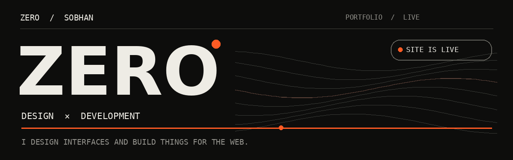
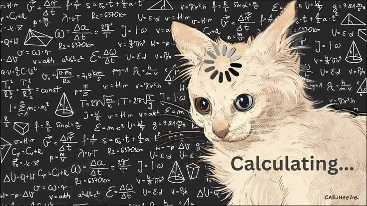
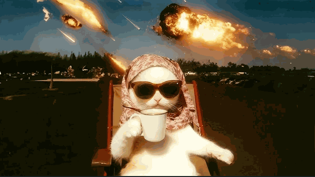
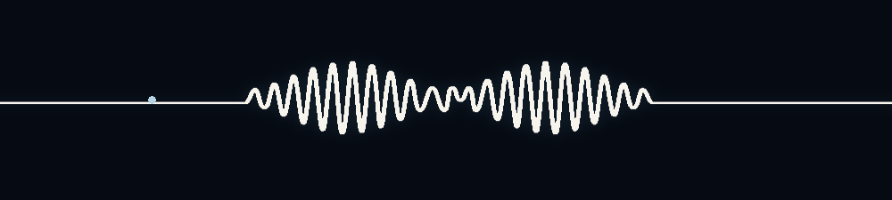

  

<h1 align="center">ZERO / The portfolio</h1>

<strong>One person. Design, code and everything between.</strong>

  <a href="https://zeroux-dev.github.io/"><strong>↗ EXPLORE THE LIVE SITE</strong></a>
  &nbsp;·&nbsp;
  <a href="https://zeroux-dev.github.io/?lang=fa">نسخهٔ فارسی</a>
  &nbsp;·&nbsp;
  <a href="https://t.me/fesqhli">START A PROJECT</a>

  This repository contains the personal website of <strong>Sobhan, a.k.a. ZERO</strong> — a place to explore the work, the process and the services behind the name.

این مخزن، خانهٔ وب‌سایت شخصی <strong>سبحان / ZERO</strong> است؛ جایی برای دیدن نمونه‌کارها، خدمات و مسیری که طراحی را به محصول قابل‌استفاده تبدیل می‌کند.

---

## 01 / The experience

This is a single-page portfolio built around a simple idea: **let the work speak clearly**. The page moves from an introduction to services, selected projects and a direct conversation.

| | Inside the site |
| :--- | :--- |
| ◈ **Language** | Switch between English and Persian with a layout that changes direction for RTL text. |
| ◈ **Atmosphere** | Four visual themes: Ink, Paper, Blueprint and Moss. |
| ◈ **Motion** | Flowing canvas lines, an opening sequence, scroll reveals and interaction details. |
| ◈ **Navigation** | Responsive sections, mobile menu and direct links to each part of the page. |
| ◈ **Discoverability** | Meta and social tags, structured data, sitemap and robots file. |
| ◈ **Consideration** | Reduced-motion preference is handled in the page's animations. |

> **Try it:** [open the site](https://zeroux-dev.github.io/), switch **EN / FA**, then use the background control to explore all four themes.

## 02 / Take a look around

| Section | What you'll find |
| :--- | :--- |
| [**About**](https://zeroux-dev.github.io/#about) | The person behind ZERO and the meeting point of design and code. |
| [**Services**](https://zeroux-dev.github.io/#services) | UI/UX, web development, WordPress, SEO, Telegram apps, Flask and Unity. |
| [**Selected work**](https://zeroux-dev.github.io/#work) | Live storefronts, an open-source Flask project and work in progress. |
| [**Contact**](https://zeroux-dev.github.io/#contact) | A direct way to start a conversation on Telegram. |

<table>
  <tr>
    <td width="55%" valign="middle">
      <h3>Thinking is part of the build.</h3>
      
Before a component becomes a polished screen, there is a lot of sketching, questioning, testing and reworking. The little cat has the right expression for that part of the process.

      
<strong>Observe → Design → Build → Refine</strong>

    </td>
    <td width="45%" align="center" valign="middle">
      
    </td>
  </tr>
</table>

## 03 / Work behind the portfolio

The site links directly to projects and public showcases. These are **projects featured by the portfolio**, not pages built into this repository.

| Project | Focus | Live / demo |
| :--- | :--- | :--- |
| **ZxAcc** | Digital products store · WordPress | [Visit ↗](https://zxacc.store) |
| **Network Book** | Online bookstore · WooCommerce | [Visit ↗](https://network-book.ir) |
| **Nila Gallery** | Accessories store · WooCommerce | [Visit ↗](https://nilagallery.ir) |
| **Kharazi Tavos** | Craft supplies · WordPress / SEO | [Visit ↗](https://kharazitavos.com) |
| **TechBlog** | Open-source Python / Flask blog and admin panel | [Demo ↗](https://zeroux-dev.github.io/flask-tech-blog/) · [Code ↗](https://github.com/zeroux-dev/flask-tech-blog) |

## 04 / Under the hood

This website is delivered as a static GitHub Pages site. Its layout, styles and interactions live in **[index.html](./index.html)**; there is no package installation or build command for the portfolio.

| File | Role |
| :--- | :--- |
| [index.html](./index.html) | Page markup, responsive styles, translations, themes and interactions. |
| [sitemap.xml](./sitemap.xml) | Sitemap for the published site. |
| [robots.txt](./robots.txt) | Crawling guidance. |
| [README.md](./README.md) | This project overview on GitHub. |
| `*.gif` in this directory | Animated artwork used in this README. |

**To explore locally:** clone this repository and open `index.html` in a browser. Google Fonts and the profile portrait use external URLs, so those details need an internet connection.

<i>When the brief gets dramatic: find the next clear step and keep building.</i>

## 05 / Open channel

  Have a website, store, interface or Telegram idea in mind? 
  <strong><a href="https://t.me/fesqhli">Let's talk on Telegram ↗</a></strong>
  &nbsp;·&nbsp;
  <a href="https://zeroux-dev.github.io/">Explore ZERO's website ↗</a>

ZERO / SOBHAN · DESIGN × DEVELOPMENT

