<!--
  zeroux-dev.github.io — personal site of ZERO (Sobhan)
  Author: ZERO (Sobhan) · https://github.com/zeroux-dev · Telegram @fesqhli
-->

<p align="center">
  <a href="https://zeroux-dev.github.io/"></a>
</p>

<h1 align="center">
  
  zeroux-dev.github.io
  
</h1>

<p align="center">
  <a href="https://zeroux-dev.github.io/"></a>
</p>

<p align="center">
  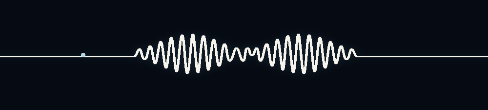
</p>

<p align="center">
  <a href="https://zeroux-dev.github.io/"></a>
  <a href="https://zeroux-dev.github.io/?lang=fa"></a>
  <a href="https://t.me/fesqhli"></a>
  <a href="https://github.com/zeroux-dev"></a>
</p>

<p align="center">
  
  
  
  
  
  
  
</p>

<p align="center">
  <a href="https://zeroux-dev.github.io/">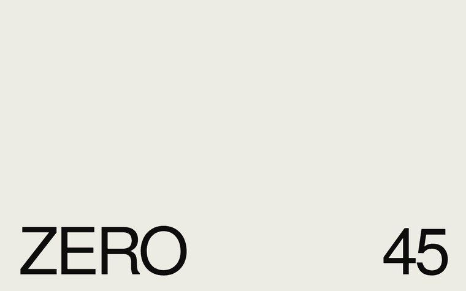</a>
  <br><sub>▶ loader → headline reveal → 3D lines react to scroll → background switch → Persian (RTL)</sub>
</p>

<p align="center"></p>


##  What's inside

| | |
|---|---|
| **Scroll-driven 3D lines** | A wave field projected in 3D on `<canvas>`. Scrolling tilts the camera and pulls the lines toward you; the mouse adds a little yaw. |
| **FA / EN switch** | In the header *and* footer. Real RTL layout, remembers your choice, supports `?lang=fa` links. |
| **One-button backgrounds** | **Ink**, **Paper**, **Blueprint**, **Moss** — revealed with a circular View Transition from the button. |
| **Motion** | Counter loader, word-by-word headline, clip-reveal portrait, magnetic buttons, cursor-following project preview, marquee, accordion. |
| **Accessible** | Respects `prefers-reduced-motion`, semantic landmarks, keyboard friendly, readable contrast in every theme. |
| **SEO** | Bilingual title/description, Open Graph, `Person` JSON-LD, canonical, `sitemap.xml`, `robots.txt`, Search Console verified. |
| **Zero dependencies** | One `index.html` (~49 KB). No framework, no build step. |

##  How the 3D lines work

<table>
  <tr>
    <td width="46%">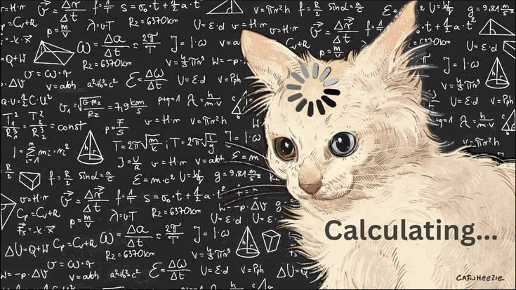</td>
    <td>
      
      <br><br>
      Every frame, <b>38 lines × 110 points</b> of a sine-noise terrain are rotated and projected with a tiny perspective camera — no WebGL, no library.
      <br><br>
      Scroll = camera <b>pitch</b> & forward travel · Mouse = <b>yaw</b> · Every 9th line takes the accent colour of the active theme.
    </td>
  </tr>
</table>

##  Four backgrounds, one button

<p align="center">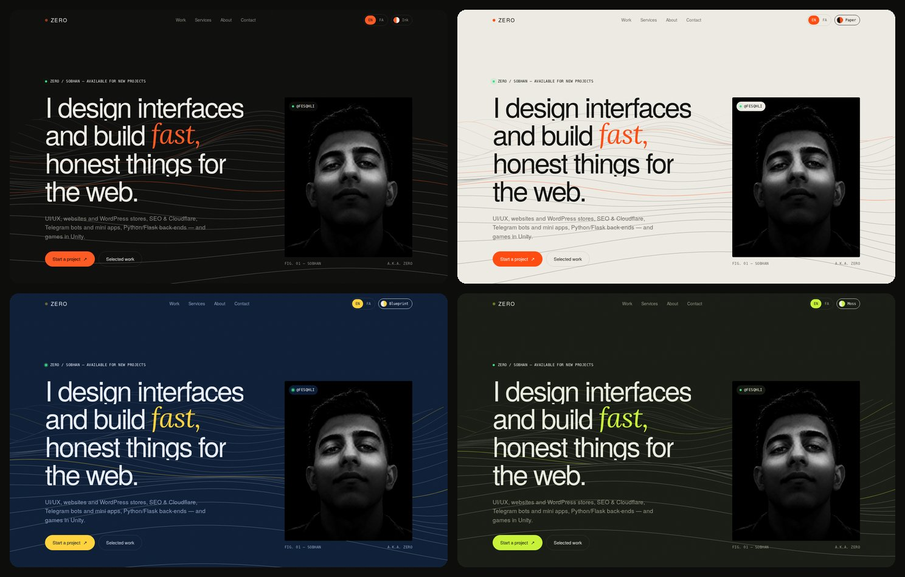</p>

##  Screens

<table>
  <tr>
    <td width="50%">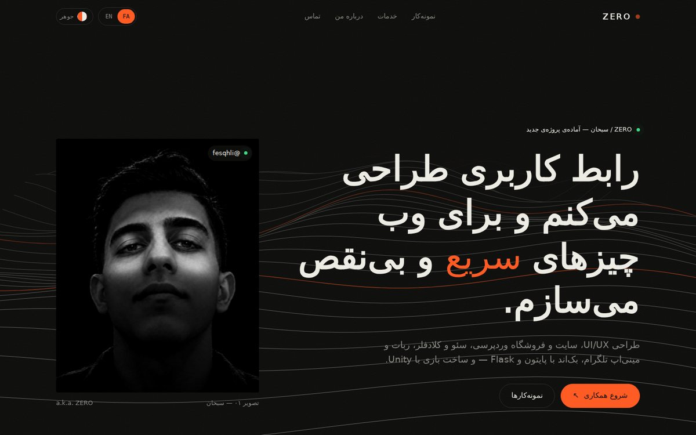<p align="center"><sub>Persian · RTL</sub></p></td>
    <td width="50%">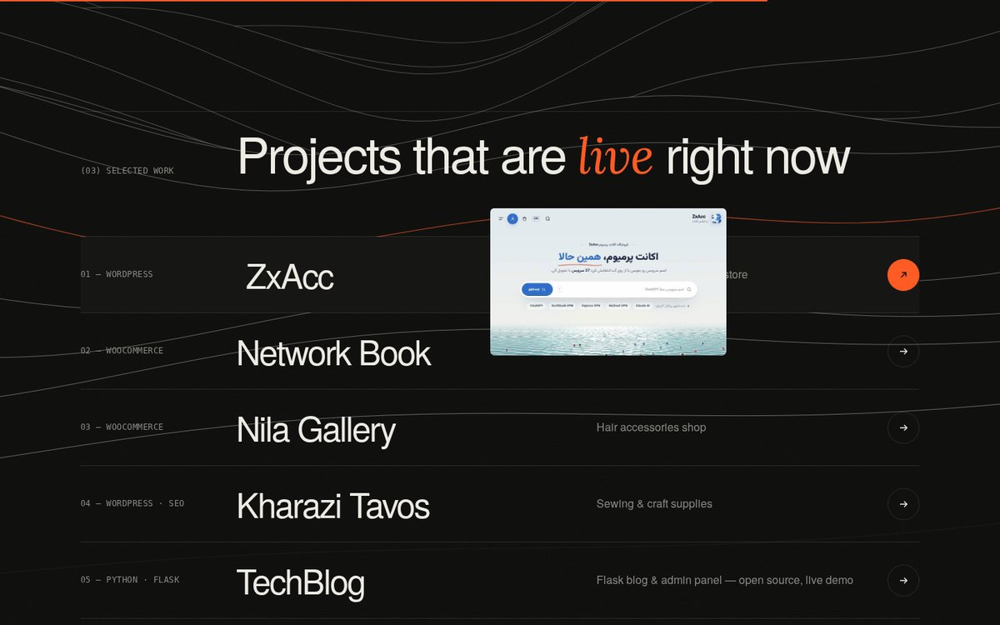<p align="center"><sub>Work · preview follows the cursor</sub></p></td>
  </tr>
  <tr>
    <td width="50%">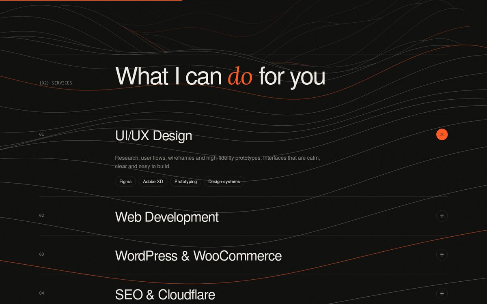<p align="center"><sub>Services · accordion</sub></p></td>
    <td width="50%">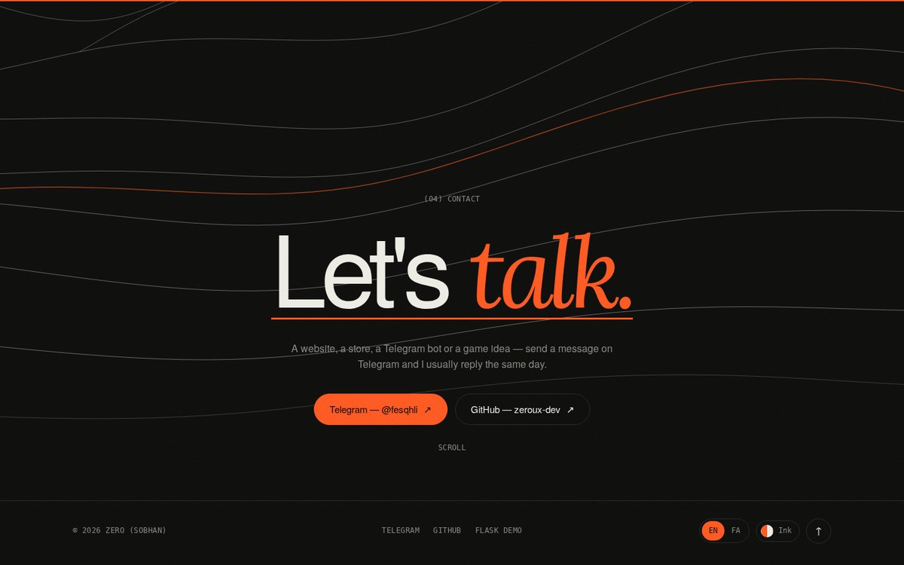<p align="center"><sub>Contact</sub></p></td>
  </tr>
</table>

<p align="center">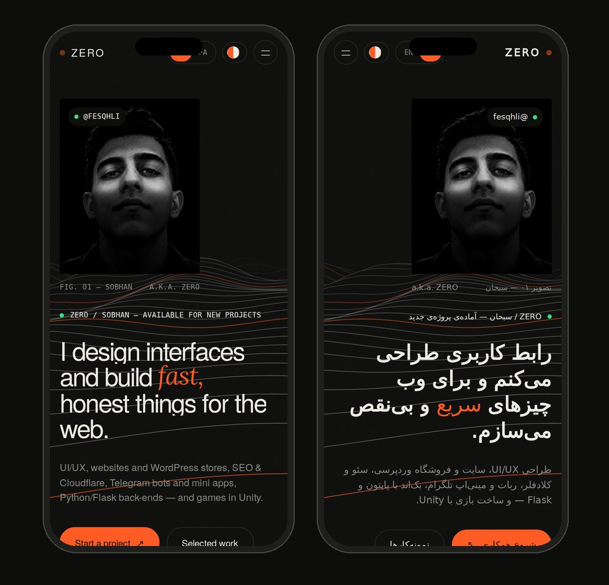<br><sub>Mobile · EN / FA</sub></p>

<p align="center"></p>

##  Structure

```
zeroux-dev.github.io/
├── index.html      ← the whole site: HTML + CSS + JS + FA/EN texts
├── sitemap.xml     ← pages for Google
├── robots.txt
├── README.md
└── assets/         ← images used only by this README
```

Run locally: open `index.html`, or `python -m http.server` → `http://localhost:8000`.

##  Add a new project (English)

1. Open **`index.html`** on GitHub → ✏️ Edit.
2. <kbd>Ctrl</kbd>+<kbd>F</kbd> → `class="work"`.
3. Copy one full line starting with `<a class="item rv"` and paste it right below.
4. Change in your copy:

   ```html
   <a class="item rv" href="LINK-TO-PROJECT" target="_blank" rel="noopener"
      data-img="LINK-TO-A-SCREENSHOT.jpg">
     <span class="n mono mut">07 — TYPE · STACK</span>
     <h3>Project Name</h3>
     <span class="meta mut" data-i="w7">Short English description</span>
     …keep the rest (<span class="go">…</span><span class="thumb"></span>) as it is…
   </a>
   ```
5. Translations: search `'w6':` — it appears in `en:{…}` and `fa:{…}`. Add `'w7':'English text',` and `'w7':'متن فارسی',`.
6. **Commit changes** → the site updates in ~1 minute.

> [!TIP]
> For `data-img`, put a screenshot in the project's repo and use its raw link:
> `https://raw.githubusercontent.com/zeroux-dev/REPO/main/screenshots/home.jpg` (1600×1000 JPG, under 300 KB).

<div dir="rtl">

## آموزش اضافه کردن پروژه (فارسی)

1. در گیت‌هاب فایل **`index.html`** را باز کن و روی مداد ✏️ بزن.
2. با <kbd>Ctrl</kbd>+<kbd>F</kbd> عبارت `class="work"` را پیدا کن.
3. یکی از خط‌هایی که با `<a class="item rv"` شروع می‌شود را کامل کپی کن و زیرش بچسبان.
4. در خط جدید این‌ها را عوض کن:
   - `href` ← لینک سایت یا دموی پروژه
   - `data-img` ← لینک عکس پروژه (با بردن موس روی پروژه نمایش داده می‌شود)
   - `07 — …` ← شماره و نوع پروژه
   - داخل `<h3>` ← اسم پروژه
   - `data-i="w7"` ← یک کلید جدید (w7، w8، …)
5. ترجمه‌ها: عبارت `'w6':` را جستجو کن؛ دو جا پیدا می‌شود (بخش `en` و بخش `fa`). کنار هرکدام اضافه کن: `'w7':'English text',` و `'w7':'متن فارسی',`
6. **Commit changes** را بزن؛ حدود ۱ دقیقه بعد سایت آپدیت می‌شود.

**عوض کردن متن‌ها:** همه‌ی متن‌های فارسی و انگلیسی داخل `index.html` در بخش `const T={ en:{…}, fa:{…} }` هستند. فقط متن داخل کوتیشن را عوض کن و کلیدها را دست نزن.

**عکس پروفایل:** از عکس پروفایل گیت‌هاب خوانده می‌شود؛ عکس گیت‌هاب را عوض کنی، سایت هم عوض می‌شود.

</div>


##  Status

<table>
  <tr>
    <td width="52%">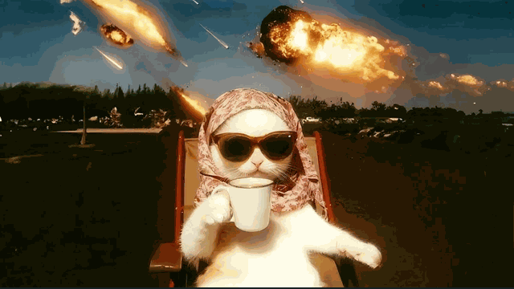</td>
    <td>
      
      <br><br>
      Client asks for a “small change” at 2 AM?<br>
      <b>Me, calmly shipping it.</b>
      <br><br>
      <a href="https://t.me/fesqhli"></a>
    </td>
  </tr>
</table>

##  Author

<table>
  <tr>
    <td width="120"></td>
    <td>
      <b>ZERO — Sobhan</b><br>
      UI/UX · Web · WordPress · SEO · Telegram bots & mini apps · Python/Flask · Unity<br><br>
      <a href="https://zeroux-dev.github.io/">Website</a> ·
      <a href="https://t.me/fesqhli">Telegram @fesqhli</a> ·
      <a href="https://github.com/zeroux-dev">GitHub</a> ·
      <a href="https://github.com/zeroux-dev/flask-tech-blog">Flask project</a>
    </td>
    <td width="150" align="right"><a href="https://t.me/fesqhli">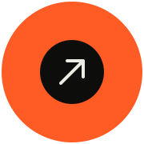</a></td>
  </tr>
</table>

<p align="center"></p>

<p align="center">
  
</p>

<sub>© 2026 ZERO (Sobhan). Design and code of this site are not open for reuse — please don't copy it as your own portfolio. Want something like it? Message <a href="https://t.me/fesqhli">@fesqhli</a>.</sub>
